# Airbnb Clone — Full-Stack SDE Assignment


A full-stack Airbnb clone: a relational marketplace backend and a faithful,
responsive marketplace UI. Built to be read and defended line by line — no
unnecessary abstractions, no external services, no hidden magic.

| | |
| --- | --- |
| **Frontend** | Next.js 16 (App Router) · TypeScript · Tailwind CSS v4 · Lucide React · Leaflet |
| **Backend** | Python · FastAPI · Pydantic v2 · SQLAlchemy 2.0 ORM |
| **Database** | SQLite (local file, fully relational) |
| **Auth** | Lightweight mock auth via an `X-User-Id` header |
| **Status** | Phases 1–4 + feature expansion complete · verified end-to-end with a headless-browser suite |

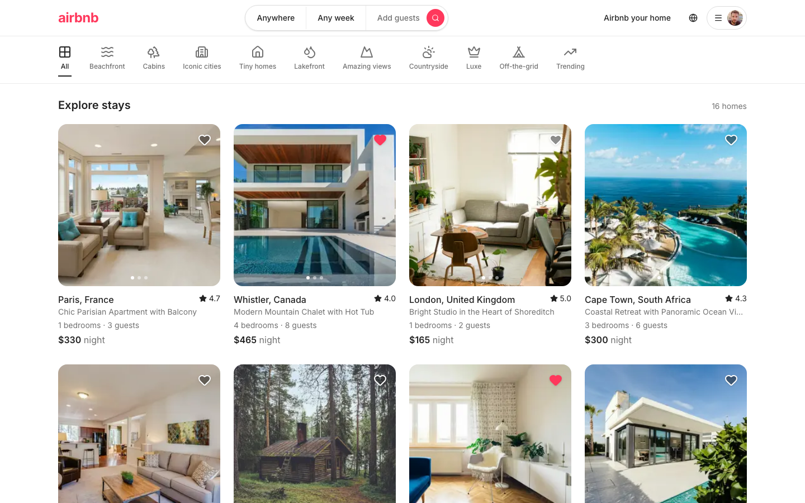

---

## Table of contents

- [Features](#features)
- [Tech stack & rationale](#tech-stack--rationale)
- [Architecture](#architecture)
- [Database schema](#database-schema)
- [The overlap validation rule](#the-overlap-validation-rule)
- [Mock authentication](#mock-authentication)
- [Local setup](#local-setup)
- [Screenshots](#screenshots)
- [API reference](#api-reference)
- [Design decisions & trade-offs](#design-decisions--trade-offs)
- [Mocking assumptions](#mocking-assumptions)
- [Known limitations](#known-limitations)
- [Further documentation](#further-documentation)

---

## Features

**Marketplace**
- Search & filter listings by text, city, category, price range, guest count and availability dates, with pagination.
- Airbnb-style home: sticky navbar with an expandable Where/When/Who search pill, a horizontal category bar, and a responsive card grid.
- **Interactive map view** (Leaflet + OpenStreetMap) with Airbnb-style price-pill pins and popups that link to listings.
- Listing detail: 5-photo hero with a full-screen gallery, amenities with icons, a location map, a reviews section with a rating breakdown, and a sticky booking widget.
- **Dark mode** with a pre-paint theme script (no flash) and a one-click toggle.

**Booking**
- Interactive date-range calendar that **greys out already-booked nights** and prevents overlapping stays.
- Live price breakdown (nightly rate × nights + cleaning fee + service fee) and a mocked checkout modal.
- Backend overlap validation is authoritative, so the calendar and server can never disagree.
- "My Trips" with upcoming/past sections, cancellation that frees the dates, and a **mobile sticky price + Reserve bar**.

**Trust & reviews**
- **Leave a review after a completed stay** (star picker + comment), with server-side eligibility (must be a finished, confirmed, not-yet-reviewed booking).
- **Ratings aggregation** and a **Superhost badge** derived from a host's average rating, review count and listing count.

**Hosting**
- "Become a host" create/edit listing form (title, category, pricing, amenities) with **direct image upload** to storage.
- Host dashboard with stats, listing management (edit/delete) and the reservations guests placed.
- One-click Guest ⇄ Host switch in the account menu.

**Polish**
- Toast notifications for every meaningful action (booking confirmed, listing created/updated/deleted, added to wishlist, review posted, cancelled, …).
- Optimistic wishlist hearts with rollback on error.
- Responsive layouts verified at phone (390px), tablet (768px) and desktop (1440px).

---

## Tech stack & rationale

| Choice | Why |
| --- | --- |
| **FastAPI** | Automatic OpenAPI docs at `/docs` and Pydantic validation remove a whole class of manual request-parsing code. |
| **SQLAlchemy 2.0 ORM** | Typed `Mapped[...]` models keep the schema in one readable place; relationships express foreign keys declaratively. |
| **SQLite** | Zero-infrastructure, file-based, fully relational. Easy to inspect; swapping to Postgres is a one-line change in `database.py`. |
| **Pydantic v2** | Keeps the *storage* shape (models) separate from the *wire* shape (schemas), so computed fields never leak into tables. |
| **Next.js App Router** | File-based routing, streaming, and a clear server/client boundary. |
| **Tailwind CSS v4** | Design tokens declared once in `@theme` generate the whole utility set — no drifting stylesheets. |
| **Lucide React** | Large, consistent icon set; amenity icon names are stored in the DB and mapped once on the client. |

---

## Architecture

```
.
├── backend/                 # FastAPI + SQLAlchemy + SQLite
│   ├── main.py              # app assembly: lifespan table creation, CORS, routers
│   ├── database.py          # engine, session factory, get_db(), SQLite FK pragma
│   ├── models.py            # ORM schema (8 tables)
│   ├── schemas.py           # Pydantic request/response contracts
│   ├── deps.py              # mock-auth dependencies
│   ├── serializers.py       # shared ORM → schema mapping (ratings, images, favorites)
│   ├── seed.py              # reproducible demo data
│   └── routers/{listings,bookings,users}.py
├── frontend/                # Next.js App Router
│   ├── app/                 # routes: home, listing detail, trips, host, wishlist
│   ├── components/          # UI (navbar, cards, calendar, booking widget, …)
│   ├── context/             # mock auth, shared search state, toasts
│   └── lib/                 # typed API client, types, formatting, hooks
└── docs/                    # architecture docs + screenshots
```

**Request flow:** the browser fetches the API at `NEXT_PUBLIC_API_URL`, attaching
the acting user's id as an `X-User-Id` header. Locally that is the FastAPI dev
server directly; on Vercel the frontend and backend are one project and the
browser calls `/api/...` on the same origin (`NEXT_PUBLIC_API_URL=same-origin`),
which Vercel routes to the FastAPI service. FastAPI resolves the user from the
header, runs the query through SQLAlchemy against SQLite, and returns a
Pydantic-serialized JSON response. Writes (booking, listing CRUD) are validated
server-side — the client is never trusted.

---

## Database schema

Eight tables, fully relational. All foreign keys use `ON DELETE CASCADE`, and
the SQLite connection enables `PRAGMA foreign_keys=ON` so cascades actually fire.

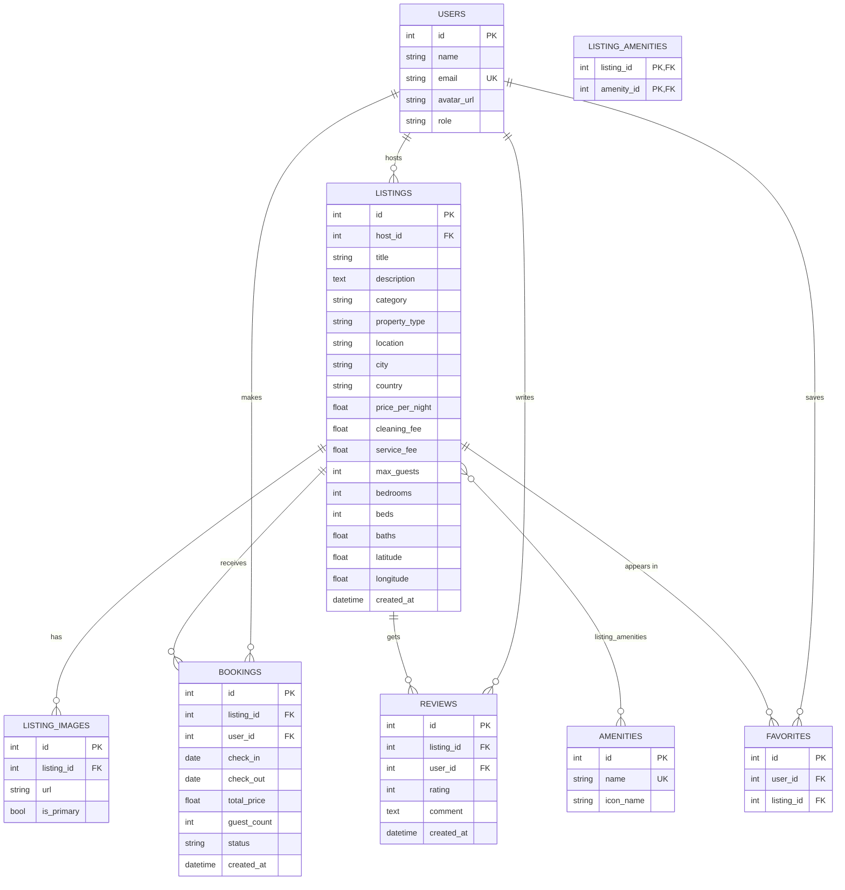

**Cardinalities**
- One **host** (`users`) owns many **listings**; each listing has many **listing_images** (one flagged `is_primary`).
- **listings ↔ amenities** is many-to-many through `listing_amenities` (a plain association table, no payload).
- One **user** makes many **bookings**; one **listing** receives many bookings.
- One **user** writes many **reviews**; one **listing** collects many reviews.
- **favorites** has `UNIQUE(user_id, listing_id)` so a listing can be wishlisted once per user.

`baths` is a `float` because half-baths (1.5, 2.5) are real; `role` is a string
(`guest` | `host` | `both`) validated by the API rather than a DB enum.

---

## The overlap validation rule

Two half-open date ranges `[a_in, a_out)` and `[b_in, b_out)` **overlap if and
only if**:

```
a_in < b_out   AND   b_in < a_out
```

The strict `<` is deliberate: a guest may check out on the same day the next
guest checks in — the shared boundary day is not a conflict. This is the
standard hotel/calendar rule and it is what allows back-to-back bookings.

```python
# backend/routers/bookings.py
db.query(Booking).filter(
    Booking.listing_id == listing_id,
    Booking.status == "confirmed",
    Booking.check_in  < check_out,   # existing starts before the new range ends
    Booking.check_out > check_in,    # existing ends after the new range starts
).first()
```

`POST /api/bookings` validates, in order:

1. `check_in < check_out`
2. `check_in >= today`
3. `guest_count <= listing.max_guests`
4. the guest is not the listing's own host
5. **no overlapping confirmed booking** (409 if there is)
6. price is recomputed server-side as `price_per_night × nights + cleaning_fee + service_fee`

The **same predicate** hides unavailable listings in `GET /api/listings` when a
`check_in`/`check_out` filter is supplied, and the frontend calendar reuses it in
`lib/format.ts` — so search, booking and the UI can never disagree.

Cancelling sets `status = "cancelled"` (the row is kept for history) which
immediately frees the dates, because only `confirmed` bookings are considered.

---

## Mock authentication

There is no password or session. The client identifies which seeded profile it
is acting as with a header:

| Header | Profile | Role |
| --- | --- | --- |
| `X-User-Id: 1` | Alex Chen | guest |
| `X-User-Id: 2` | Sarah Mitchell | both (host) |

- `deps.get_current_user` resolves the acting user (defaulting to `1`).
- `deps.require_host` gates host-only endpoints by role.
- In the UI, the account menu's **"Switch to hosting / travelling"** simply
  changes the header value; `GET /api/users` supplies the demo profiles.

Swapping this for real JWT auth later means changing only `deps.py` plus adding
a login endpoint.

---

## Local setup

**Prerequisites:** Python 3.11+ and Node 20+.

### 1. Backend (terminal 1)

```bash
cd backend
python3 -m venv .venv
source .venv/bin/activate          # Windows: .venv\Scripts\activate
pip install -r requirements.txt

python seed.py                     # create + populate the SQLite database
uvicorn main:app --reload          # http://127.0.0.1:8000
```

- Interactive API docs: <http://127.0.0.1:8000/docs>
- Health check: <http://127.0.0.1:8000/api/health>

`seed.py` is destructive and reproducible: it drops every table and inserts
**12 users, 20 amenities, 16 listings (53 photos, 5 categories/countries apiece),
48 reviews, 7 bookings and 4 wishlist entries**. Photos are real Unsplash URLs.

```bash
# Example: browse as the guest, then as the host
curl -H "X-User-Id: 1" http://127.0.0.1:8000/api/bookings/my-trips
curl -H "X-User-Id: 2" http://127.0.0.1:8000/api/host/dashboard
```

### 2. Frontend (terminal 2)

The frontend reads `NEXT_PUBLIC_API_URL` from `frontend/.env.local`
(default `http://127.0.0.1:8000`).

```bash
cd frontend
npm install
npm run dev                        # http://localhost:3000
```

Open <http://localhost:3000>. Use the account menu to switch between guest and
host mode.

---

## Deployment

Both apps deploy as **one Vercel project** using
[Vercel Services](https://vercel.com/docs/services): the Next.js frontend and the
FastAPI backend share a single domain, and the root [`vercel.json`](vercel.json)
routes `/api/*` and `/uploads/*` to the backend. Because they share one origin
there is **no CORS to configure** — the frontend calls the API with relative URLs
(`NEXT_PUBLIC_API_URL=same-origin`).

Full step-by-step guide: **[`docs/DEPLOYMENT.md`](docs/DEPLOYMENT.md)**. The short version:

1. Vercel → **Add New → Project** → import the repo.
2. Leave **Root Directory at the repo root (`./`)**, Framework Preset = `Services`.
3. Set `NEXT_PUBLIC_API_URL=same-origin`, then deploy.
4. Verify `/api/health` → `{"status":"ok"}` and that the home page loads listings.

> ⚠️ **Monorepo gotcha:** the Vercel project root must be the repository root so
> the root `vercel.json` (which defines both services) is picked up. Setting it
> to `frontend/` leaves the deployment without a backend. `NEXT_PUBLIC_*` values
> are inlined at build time, so redeploy after changing them.

> ℹ️ On Vercel the backend stores SQLite in ephemeral `/tmp` (auto-seeded on
> boot). For durable data, run the backend on a container host instead (Render
> via [`render.yaml`](render.yaml), or Railway/Fly) and point
> `NEXT_PUBLIC_API_URL` at it — see the guide's alternative section.

## Screenshots

| Listing detail | Booking calendar |
| --- | --- |
| 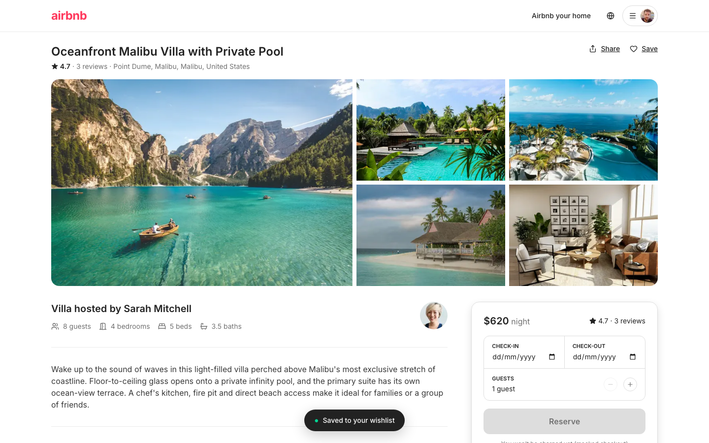 | 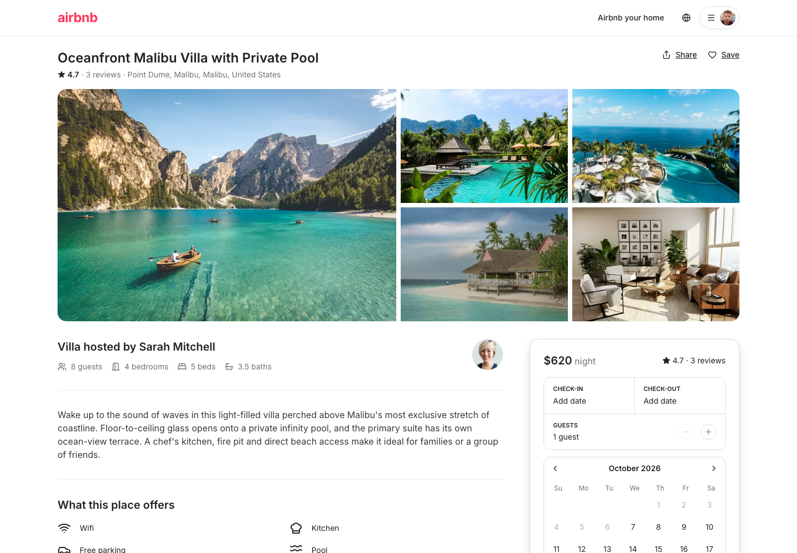 |

| Map search (price pins) | Dark mode |
| --- | --- |
| 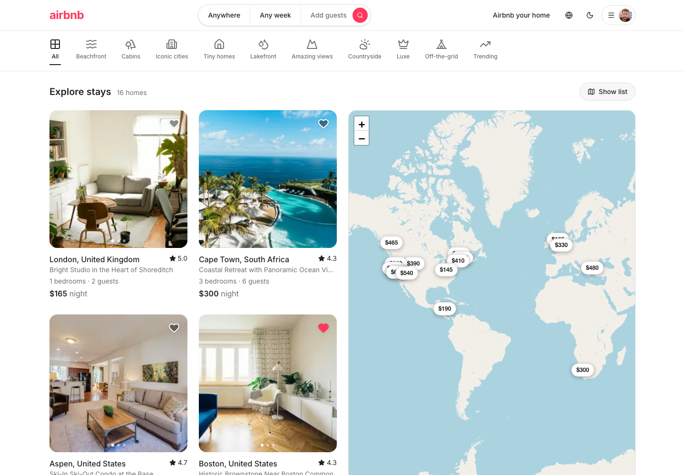 | 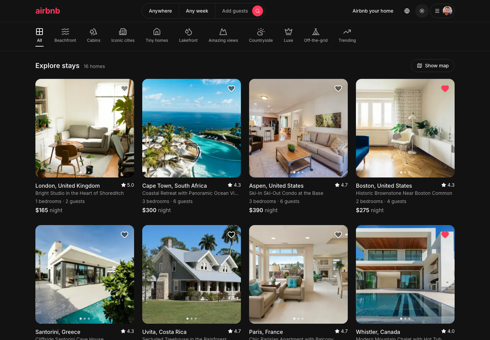 |

| My Trips | Leave a review |
| --- | --- |
| 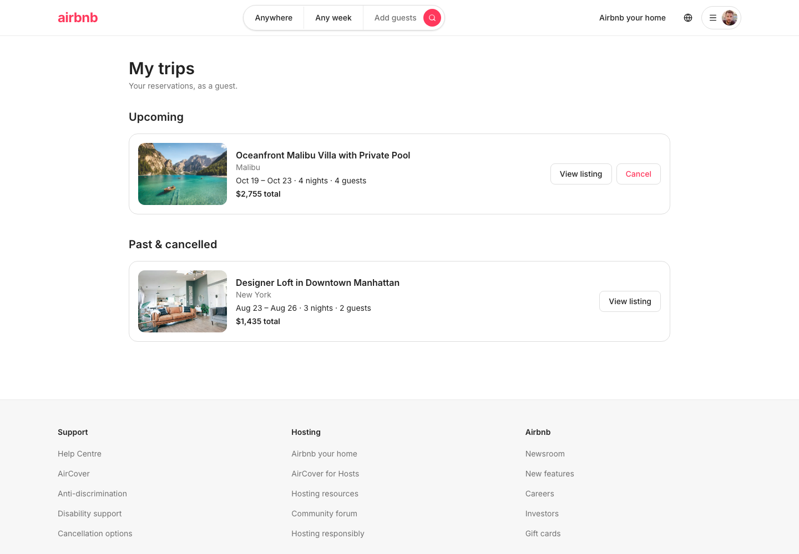 | 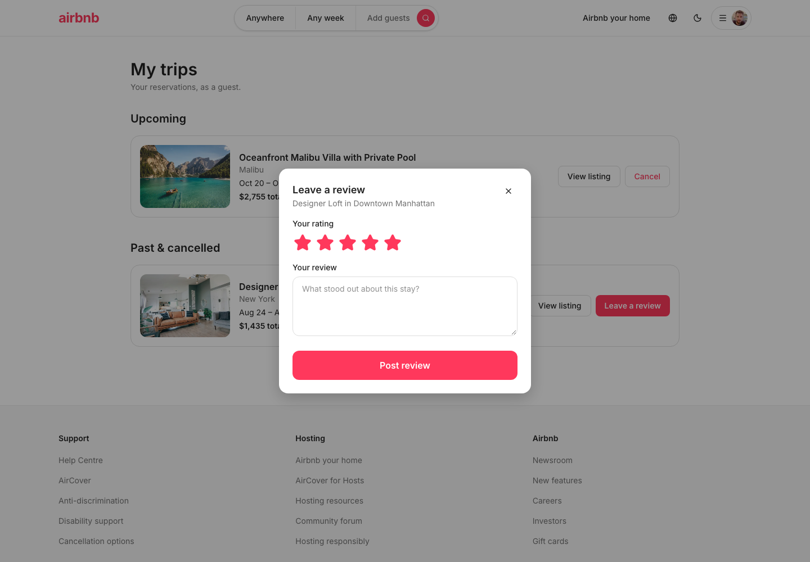 |

| Host dashboard | Create a listing |
| --- | --- |
| 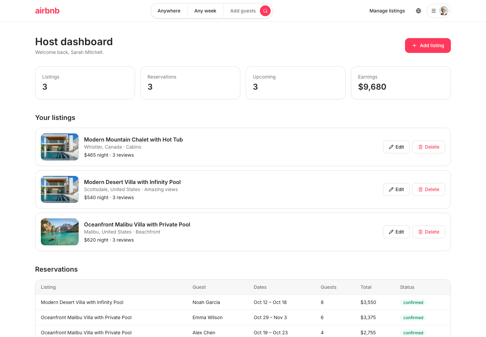 | 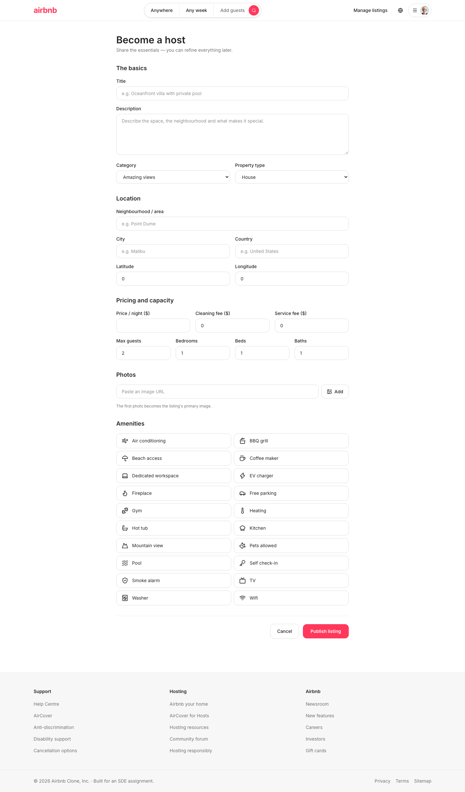 |

| Mobile home | Mobile listing detail |
| --- | --- |
| 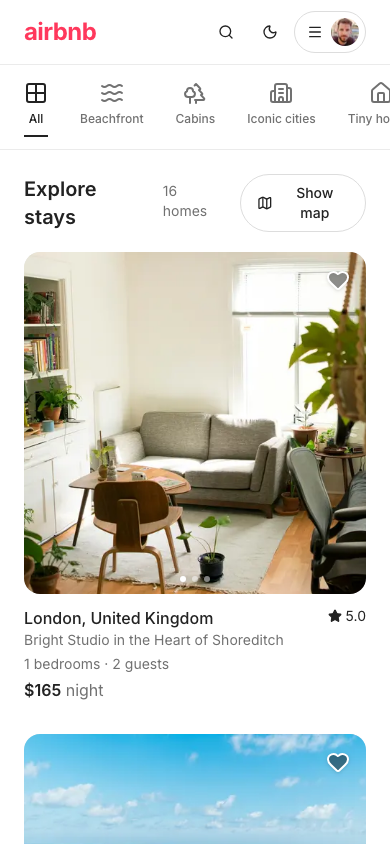 | 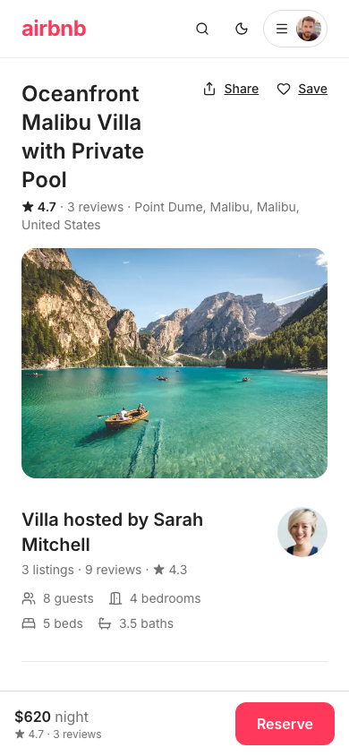 |

---

## API reference

Base URL `http://127.0.0.1:8000` · full schema at `/docs`.

| Method | Path | Auth | Purpose |
| --- | --- | --- | --- |
| GET | `/api/listings` | user | Search / filter / paginate |
| GET | `/api/listings/{id}` | user | Full detail (host, photos, amenities, reviews, booked dates) |
| POST | `/api/listings` | host | Create listing |
| PUT | `/api/listings/{id}` | owner host | Partial update |
| DELETE | `/api/listings/{id}` | owner host | Delete listing |
| GET | `/api/amenities` · `/api/categories` | – | Reference data |
| POST | `/api/bookings` | user | Create booking (overlap-validated) |
| GET | `/api/bookings/my-trips` | user | Acting user's bookings (+ review eligibility) |
| DELETE | `/api/bookings/{id}` | owner | Cancel a booking |
| POST | `/api/reviews` | completed guest | Leave a review after a stay |
| POST | `/api/uploads` | host | Upload a listing image (multipart), returns a URL |
| GET | `/api/host/dashboard` | host | Owned listings + reservations + stats |
| GET | `/api/users` · `/api/users/me` | – / user | Demo profiles / acting profile |
| GET | `/api/favorites` | user | Acting user's wishlist |
| POST | `/api/favorites/{listing_id}` | user | Toggle wishlist |

---

## Design decisions & trade-offs

- **Models vs. schemas are separate files.** `models.py` is storage; `schemas.py`
  is the wire contract, which lets responses carry computed fields (`avg_rating`,
  `nights`, `is_favorite`) that aren't columns.
- **Client-side data fetching.** Pages are Client Components so the mock-auth
  profile (which lives in client state and drives favorites/booking) is available
  everywhere. The trade-off: the initial HTML is a skeleton. With real auth you'd
  read the session on the server and fetch initial data server-side.
- **A hydration guard (`useHydrated`).** The profile arrives from the API; if it
  resolved mid-hydration the navbar would hydrate a real avatar where the server
  rendered a placeholder. The guard makes the first client render match the
  server. (This replaced relying on `suppressHydrationWarning`.)
- **Map as an iframe.** `ListingMap` embeds OpenStreetMap's own viewer instead of
  shipping Leaflet — a real pannable/zoomable map with zero bundle cost and no
  API key.
- **No `crud.py` layer.** Query logic lives in the routers; `serializers.py` is
  the only shared glue. Fewer moving parts to defend.

---

## Mocking assumptions

This is a demo, so a few things are intentionally simulated:

- **Authentication** is a header, not a login. `X-User-Id` selects the acting
  seeded profile. There is no password, session, or token.
- **Payments are mocked.** "Confirm and reserve" creates a real booking record
  and shows a full price itemization, but no card is charged and no payment
  provider is contacted.
- **Photos** are hot-linked from Unsplash's CDN (no binary assets committed).
- **Image uploads** are stored on the backend's local disk and served via
  `/uploads/<file>`. The upload endpoint mirrors the interface a cloud adapter
  (S3/Cloudinary) would implement — swapping it is a two-line change.
- **The map** uses OpenStreetMap tiles through Leaflet (no API key).
- **No email/notifications** — feedback is in-app toasts only.

---

## Known limitations

- Search sorts by newest only (no price/rating sort control).
- No automated test suite is committed; end-to-end verification was done with a
  headless-browser (Playwright) script run locally.
- The frontend fetches on the client, so the very first paint shows skeletons.

---

## Further documentation

- [`docs/backend-architecture.md`](docs/backend-architecture.md) — endpoint
  reference and backend rationale.
- [`docs/frontend-architecture.md`](docs/frontend-architecture.md) — component
  inventory, design tokens, mock-auth flow, and Next.js 16 notes.
- [`docs/airbnb-feature-study.md`](docs/airbnb-feature-study.md) — a study of
  Airbnb's features, the UX behind each, and this clone's status against them.
- [`docs/DEPLOYMENT.md`](docs/DEPLOYMENT.md) — deploying the frontend to Vercel
  and the backend to a container host, plus troubleshooting.

## Contributing

See [`CONTRIBUTING.md`](CONTRIBUTING.md). In short: run `make install`, keep
`npm run build` green, and match the surrounding style.

## License

Released under the [MIT License](LICENSE). © 2026 Devyansh Bhattacharya.

> This project is an educational clone built for an SDE assignment. It is not
> affiliated with Airbnb, and no Airbnb brand assets are used — the logo is a
> wordmark standing in for the trademarked mark.
