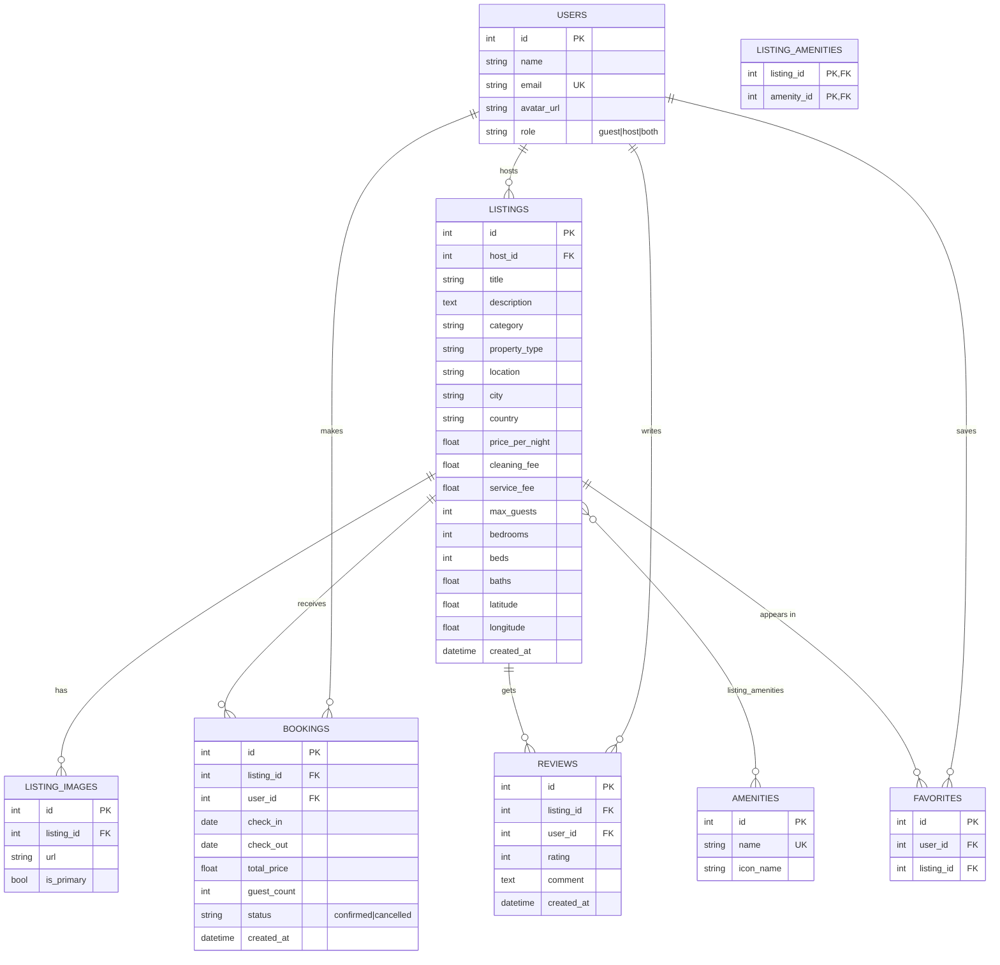

# Backend Architecture (Phase 1)

This document is the source of truth for the FastAPI + SQLite backend. It
explains *what* was built and *why*, so every line is defensible in review.

---

## 1. Tech stack and rationale

| Choice | Why |
| --- | --- |
| **FastAPI** | Async-ready, automatic OpenAPI docs at `/docs`, and Pydantic-based validation that removes a whole class of manual request-parsing code. |
| **SQLAlchemy 2.0 ORM** | Typed `Mapped[...]` models keep the schema in one readable place and generate the SQLite tables automatically. Relationships let us express foreign keys declaratively instead of hand-writing joins. |
| **SQLite** | Zero-infrastructure, file-based, fully relational. Perfect for a local assignment and easy to inspect with any SQLite client. Swapping to Postgres later means changing one line in `database.py`. |
| **Pydantic v2** | Splits the *storage* shape (models) from the *wire* shape (schemas), so computed fields (`avg_rating`, `nights`) never leak into the tables. |
| **Mock auth via header** | The assignment asks for lightweight auth. A single `X-User-Id` header is trivial to demo and keeps the focus on the marketplace logic. |

### Folder layout

```
backend/
├── main.py          # App factory: lifespan table creation, CORS, router registration
├── database.py      # Engine, session factory, get_db() dependency, SQLite FK pragma
├── models.py        # SQLAlchemy ORM models (the schema)
├── schemas.py       # Pydantic request/response contracts
├── deps.py          # Mock-auth dependencies (get_current_user, require_host)
├── serializers.py   # ORM -> schema helpers shared by all routers
├── seed.py          # Destructive, reproducible demo-data generator
└── routers/
    ├── listings.py  # Search, detail, host CRUD, plus /api/amenities & /api/categories
    ├── bookings.py  # Booking (overlap check), my-trips, cancel, reviews, host dashboard
    ├── users.py     # Demo profiles, current user, favorites toggle + list
    └── uploads.py   # Image upload (multipart) with a local-disk storage adapter
```

---

## 2. Entity-relationship diagram



**Cardinalities**

- One **host** (`users`) owns many **listings**.
- One **listing** has many **listing_images** (`is_primary` marks the hero photo).
- **listings ↔ amenities** is many-to-many through `listing_amenities`; the
  association table carries no payload, so a plain `Table` is used rather than
  a full model class.
- One **user** makes many **bookings**; one **listing** receives many bookings.
- One **user** writes many **reviews**; one **listing** collects many reviews.
- **favorites** has a `UNIQUE(user_id, listing_id)` constraint so a listing can
  only be wishlisted once per user (the toggle endpoint relies on this).

All foreign keys use `ON DELETE CASCADE`. The SQLite connection runs with
`PRAGMA foreign_keys=ON` (see `database.py`) so cascades actually fire — SQLite
ignores them by default.

---

## 3. Endpoint reference

Base URL: `http://127.0.0.1:8000` · Interactive docs: `/docs`

| Method | Path | Auth | Purpose |
| --- | --- | --- | --- |
| GET | `/api/health` | – | Liveness check |
| GET | `/api/listings` | user | Search/filter/paginate listings |
| GET | `/api/listings/{id}` | user | Full detail incl. host, photos, amenities, reviews, booked dates |
| POST | `/api/listings` | host | Create a listing |
| PUT | `/api/listings/{id}` | owner host | Partial update (only sent fields change) |
| DELETE | `/api/listings/{id}` | owner host | Delete listing (cascades) |
| GET | `/api/amenities` | – | Amenity reference data |
| GET | `/api/categories` | – | Distinct categories present |
| POST | `/api/bookings` | user | Create booking (with overlap validation) |
| GET | `/api/bookings/my-trips` | user | Acting user's bookings (+ `can_review` / `reviewed`) |
| DELETE | `/api/bookings/{id}` | owner | Cancel a booking (status → cancelled) |
| POST | `/api/reviews` | completed guest | Review a finished stay (validated server-side) |
| POST | `/api/uploads` | host | Upload an image (multipart); returns an absolute URL |
| GET | `/api/host/dashboard` | host | Owned listings + incoming reservations + stats |
| GET | `/api/users` | – | Demo profiles (for the host/guest switcher) |
| GET | `/api/users/me` | user | Acting profile |
| GET | `/api/favorites` | user | Acting user's wishlist |
| POST | `/api/favorites/{listing_id}` | user | Toggle a listing in/out of the wishlist |

### Search query parameters (`GET /api/listings`)

`q`, `city`, `category`, `min_price`, `max_price`, `guests`, `check_in`,
`check_out`, `limit` (default 20, max 100), `offset`.

All filters compose as AND conditions in a single SQLAlchemy query, so SQLite
performs the filtering and pagination — the app never loads the whole table.

---

## 4. Overlap validation (the critical piece)

Two half-open date ranges `[a_in, a_out)` and `[b_in, b_out)` **overlap if and
only if**:

```
a_in < b_out   AND   b_in < a_out
```

The strict `<` is deliberate. It means a guest may check out on the same day the
next guest checks in — the shared boundary day is not a conflict. This is the
standard calendar/hotel rule and it is what makes back-to-back bookings
possible.

Implementation (`routers/bookings.py`):

```python
db.query(Booking).filter(
    Booking.listing_id == listing_id,
    Booking.status == "confirmed",
    Booking.check_in  < check_out,   # existing starts before new ends
    Booking.check_out > check_in,    # existing ends after new starts
).first()
```

The **same predicate** is reused in the search endpoint to hide listings that
are unavailable for a requested window, so search results and booking
validation can never disagree.

`POST /api/bookings` performs these checks, in order:

1. `check_in < check_out` (400 otherwise)
2. `check_in >= today` (400 otherwise)
3. `guest_count <= listing.max_guests` (400 otherwise)
4. guest is not the listing's own host (400)
5. no overlapping **confirmed** booking (409)
6. price is recomputed server-side as
   `price_per_night × nights + cleaning_fee + service_fee` — the client's total
   is never trusted.

Cancelling sets `status = "cancelled"` instead of deleting the row, so trip
history survives and the dates immediately free up (the overlap query only
looks at `confirmed` bookings).

---

## 5. Mock authentication

Every request may carry an `X-User-Id` header identifying which seeded profile
is acting. `deps.get_current_user` resolves it (defaulting to user `1`), and
`deps.require_host` gates host-only endpoints by role.

| Header value | Profile | Role |
| --- | --- | --- |
| `X-User-Id: 1` | Alex Chen | guest |
| `X-User-Id: 2` | Sarah Mitchell | both (host) |

Switching the UI between Guest and Host mode is simply switching this header.
`GET /api/users` returns all profiles so the frontend knows the ids.

---

## 6. Seed data

`python seed.py` drops and recreates every table, then inserts:

- **12 users** (2 demo + 5 hosts + 5 reviewers)
- **20 amenities** with Lucide icon names
- **16 listings** across 12 categories/cities/countries, each with 3–5 real
  Unsplash photos and a hand-picked amenity set
- **48 reviews**, **7 bookings** (including a cancelled one and blocked date
  ranges) and **4 wishlist entries**

Photos are hot-linked from Unsplash's CDN (verified to resolve), so nothing
binary is committed and the data looks real immediately.

> Seed detail: the demo guest (id 1) is deliberately **excluded** from the review
> authors so their own completed stays remain reviewable in the demo.

---

## 7. Trust, reviews and uploads (extended features)

### Superhost aggregation

`HostOut` (`schemas.py`) extends `UserOut` with `is_superhost`, `avg_rating`,
`reviews_count` and `listings_count`. `serializers.serialize_host` derives them
with a single aggregate query over the host's listings' reviews, plus a listing
count. Superhost requires `avg_rating >= 4.8`, `reviews_count >= 5` and
`listings_count >= 1` — a readable approximation of Airbnb's stricter criteria.
Both the listing-detail `host` field and the dashboard `host` field use `HostOut`.

### Reviews after a completed stay

`POST /api/reviews` validates server-side: the booking must belong to the caller,
be `confirmed`, and have `check_out < today`; a guest reviews a listing once
(deduplicated on `listing_id + user_id`). `GET /api/bookings/my-trips` annotates
each booking with `can_review` and `reviewed` so the UI knows when to offer it.

### Image upload storage

`POST /api/uploads` accepts a multipart file (host-only), validates the content
type against an allow-list and a 5 MB cap, writes it to `backend/uploads/`, and
returns an **app-relative** URL (`/uploads/<file>`). FastAPI serves that path via
a `StaticFiles` mount, and the Next.js frontend proxies `/uploads/*` back to the
API (a `rewrites()` entry), so images are same-origin for `next/image`. This is
the same interface a cloud adapter (S3/Cloudinary) implements — only the write
and the URL construction are provider-specific, so swapping providers is small
and contained.
